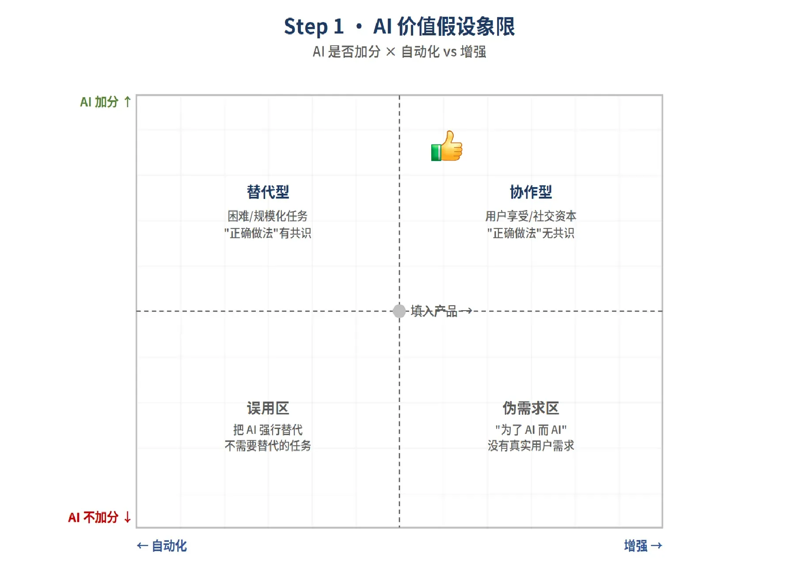
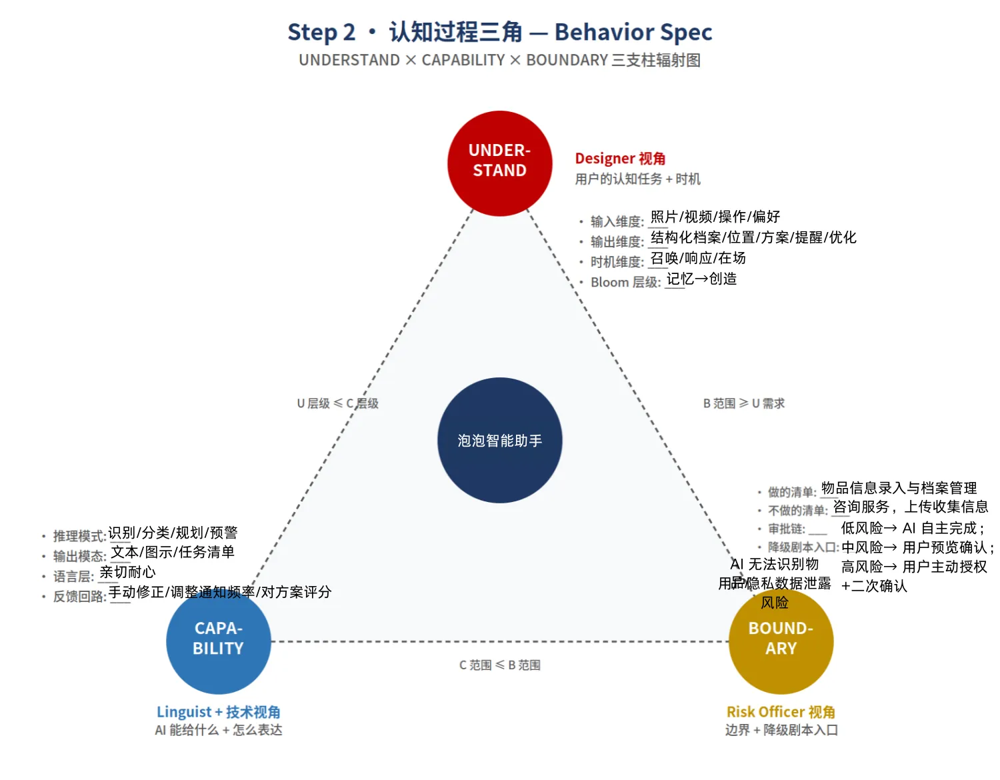
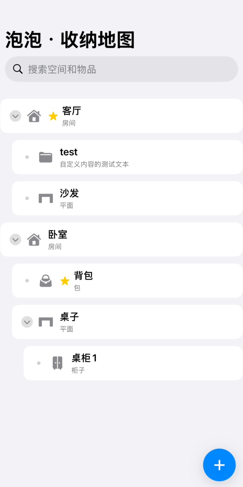

该应用聚焦于用户在个人空间中物品的寻找与整理痛点，提出了可视化数据结构的交互方式，并且设置提醒来维护物品的使用与收纳记录更新，作为一款AI辅助的智能收纳系统，它可以帮您在生活中更好的解决“有没有，放在哪，有什么”这几个问题。

## 1. 产品定义

**产品名称**：泡泡（Bubble）

我们让AI接管物品收纳整理和提醒，因为它需规模化。  
对于物品多喜欢乱扔的人群，泡泡可以帮助他们更好管理自己的物品。

### 产品定位

泡泡是一款以可视化空间结构为核心、AI辅助录入与归位提醒的智能收纳应用。它将用户的个人空间（家庭、办公室等）转化为直观的数字地图，帮助用户彻底解决物品管理中“有没有、放在哪、有什么”三大核心问题。

### 产品愿景

让每一次寻找都笃定，每一次归位都轻松。泡泡不仅是一个工具，更是一种生活秩序的养成伙伴——通过温暖、有仪式感的交互，陪伴用户建立整洁、确定、低焦虑的生活环境。

### 核心功能概述

- **形象化数据结构**：支持建立从房间到抽屉、收纳盒的多级空间树，形成数字孪生收纳地图。
- **AI辅助录入与归类**：拍照识别物品，AI自动建议类别和存放位置，用户可自定义覆盖。
- **智能检索+关联提示**：搜索物品时不仅显示位置，还同步展示同区域内的其他物品。
- **易读收纳界面+动画引导**：卡片式容器视图，点击“去找它”播放轻量级引导动画（光线/震动/箭头）。
- **用后归位提醒**：物品使用后主动提醒用户放回原处，形成闭环习惯。

---

## 2. 用户画像

| 画像名称 | 特征描述 | 核心痛点 |
|---------|---------|---------|
| 易忘族 | 年龄20-40岁，生活节奏快，经常忘记钥匙、证件、充电器、常用药品等小物件的位置。 | 记忆不可靠，每次寻找耗时5-15分钟，产生焦虑感和时间浪费。 |
| 整理爱好者 | 喜欢收纳、追求整洁，但讨厌维护记录（如写标签、做Excel）。 | 传统方式太繁琐、难坚持，希望有一种“无感”又美观的记录方式。 |
| 多空间用户 | 拥有家中、办公室、父母家、车库等多处存放点，物品分布离散。 | 常常混淆物品放在哪个空间，导致重复购买或往返寻找。 |
| 特定收藏者 | 收藏酒、茶叶、乐高、手办、工具等，对物品完整性要求高。 | 需要知道某件藏品在哪个盒子里、盒内还有哪些配件，避免丢失或遗漏。 |
| 家庭协同需求者 | 与配偶、孩子或室友共享居住空间，物品常被移动。 | 无法同步物品位置信息，经常出现“我明明放在这，谁拿走了”的争执。 |
| 独居老人/双职工家庭 | 家里物品多但无人帮忙整理，记性不佳，找不到物品时无人协助，取出后容易忘记放回。 | 物品状态可追踪，有提醒功能，降低物品丢失风险，提升居家安全感。 |

---

## 3. 使用场景

### 场景一：急用物品快速寻找

**人物**：小张（易忘族）  
**时间**：周一早晨8:15，还有5分钟出门。  
**动作**：

- 打开泡泡，语音/文字搜索“车钥匙”。
- 结果页显示：位置 → 玄关钥匙挂钩上；同位置还有：门禁卡、备用钥匙、剪刀。
- 点击“去找它”，屏幕出现一道光从“玄关”图标移动到钥匙图标，配合轻微震动。
- 小张快速找到钥匙，满意出门。

### 场景二：新物品收纳录入

**人物**：小李（整理爱好者）  
**动作**：

- 买回一管药膏，打开泡泡拍照上传。
- AI识别为“药膏”，并建议：“根据你的习惯，建议放入主卧床头柜药盒”。
- 小李确认位置，系统自动更新空间树，并提醒输入保质期（2027-05）。
- 完成后，药膏的信息被记录，后续搜索随时可用。

### 场景三：用完提醒与归位

**人物**：小张（易忘族，使用螺丝刀修完椅子后随手放在茶几上）  
**动作**：

- 泡泡检测到（或小张手动标记）螺丝刀长时间未归位。
- 半小时后，手机推送通知：“螺丝刀还在客厅茶几上，请放回阳台工具箱。”
- 用户可选择“稍后提醒”（30分钟/1小时/明天）或“已归位”。
- 长期使用后，泡泡生成归位习惯分析报告，帮助小张提高整理频率。

### 场景四：区域关联查询（不知道具体要找什么）

**人物**：小王（家庭协同需求者）  
**动作**：

- 想找备用的垃圾袋，但不记得放在哪里。
- 打开泡泡，点击导航树：厨房 → 水槽下方柜子。
- 卡片视图展示该柜子内所有物品：洗洁精、垃圾袋卷、钢丝球、厨房清洁剂。
- 小王找到了垃圾袋，同时发现洗洁精快用完了，提前采购。

---

## 4. 需求归纳

### 功能性需求

| 需求模块 | 具体需求描述 |
|---------|------------|
| 空间树管理 | 用户可以创建、编辑、删除多层空间结构（如“家->卧室->衣柜->右上抽屉”）；支持多套空间（居家、办公室等）切换。 |
| 物品录入 | 支持拍照+AI识别（物品名称、类别）；支持手动输入名称、照片、保质期、备注；AI可根据用户历史习惯推荐存放位置。 |
| 检索与关联 | 支持关键词、语音搜索；搜索结果除显示位置路径外，还需展示同一容器内所有其他物品；支持按类别、标签、最后使用时间筛选。 |
| 收纳界面可视化 | 默认视图为房间缩略图或层级列表；点击任意容器（抽屉/盒子）后，以卡片视图展示内部物品（图文+缩略图）。 |
| 引导动画 | 点击“去找它”后，播放轻量级动画：光线从屏幕中心移动至物品图标位置，同时可选震动/箭头指示（初期简单实现即可）。 |
| 归位提醒 | 用户可手动标记“用完”；系统可设置定时提醒（默认30分钟后）；提醒文案需包含物品名称和应有位置；支持“稍后”和“已归位”操作。 |
| 习惯分析 | 统计用户归位率、常遗忘物品Top5，提供周/月度报告，给出改善建议。 |

### 非功能性需求

| 类别 | 需求描述 |
|------|---------|
| 易用性 | 首次使用引导不超过3步即可建立第一个空间节点；AI识别准确率>85%即满足；交互操作符合移动端直觉。 |
| 性能 | 搜索响应时间 < 1秒；动画流畅无卡顿；支持离线查看已缓存的空间数据。 |
| 安全与隐私 | 用户数据本地加密存储，云备份需用户主动开启；不会上传用户空间照片至公共服务器（除非用户允许匿名使用数据改进AI）。 |
| 跨平台 | 先发布iOS/Android App，后续考虑Web版查看。 |
| 可扩展性 | 空间树数据结构应支持未来添加AR指引、多人协作、智能家居联动（如提醒放置在特定位置的信标）。 |

---

## 5. 产品价值

### 对用户的价值

1. **节省时间与减少焦虑**  
   平均每次找物时间从5-10分钟降低至30秒内；告别“东西明明在眼皮底下却找不到”的烦躁。

2. **降低重复购买支出**  
   清楚知道家中已有某物品（如充电线、垃圾袋、药品），避免因遗忘而重复下单。

3. **延长物品寿命**  
   通过保质期提醒、归位闭环避免物品乱放导致丢失或损坏（例如小零件、工具）。

4. **养成良好整理习惯**  
   用后归位提醒温和而持续，帮助用户逐步建立“取出-使用-放回”的行为闭环，从被动整理变为主动维护。

5. **提升家庭沟通效率**  
   家庭成员可共享空间地图（高级功能），减少“谁拿走了XX”的摩擦，营造有序、互相理解的空间氛围。

### 对社会/行业的价值

1. **推动智能化收纳普惠化**  
   将以往昂贵的仓储管理技术以轻量、亲民的形式带入普通家庭，降低数字收纳门槛。

2. **减少闲置与浪费**  
   清晰的物品清单能帮助用户意识到过度囤积问题，促进闲置物品流转或减量购买，间接支持可持续消费。

3. **探索AI在日常生活中的温暖应用**  
   泡泡不是冷冰冰的库存工具，而是富有仪式感、轻动画交互的“生活伴侣”，为AI辅助生活产品提供新范式。

---

## 6. AI在应用中的认知接管流程

我们可以将用户的物品管理全流程拆解为多个认知环节，AI将针对性接管/辅助高门槛、高重复、高易出错的环节，降低用户操作成本：

| 流程环节 | 用户原有的认知难点 | AI的接管/辅助方式 | 实现价值 |
|---------|------------------|------------------|----------|
| **物品建档阶段**：拍照/手动录入信息 | 手动输入物品名称、证件号、有效期等信息繁琐，容易输错；无法精准识别物品类型 | 1. 图像识别：自动识别照片中的物品（如身份证、银行卡、存折、食品包装），提取关键信息（证件号、有效期、生产日期），自动生成物品名称与基础信息； 2. 语音录入：用户语音描述物品，AI自动整理为结构化信息，降低录入门槛 | 减少用户手动输入的工作量，避免信息录入错误，提升建档效率 |
| **物品分类与位置标注阶段** | 不知道怎么给物品分类，分类逻辑混乱；不知道物品该放哪才好找，容易“放了就忘” | 1. 智能分类：根据物品类型、用途、使用频率，自动推荐分类方式（如“证件类/食品类/耗材类”，或按使用场景分类）； 2. 位置推荐：结合用户的收纳空间信息（如用户标注的抽屉、柜子），推荐合适的存放位置，同时标注位置层级（如“抽屉第2层”）； 3. 空间建模辅助：用户拍摄收纳空间照片，AI自动识别抽屉、柜子层级，辅助用户标注位置 | 帮助用户建立科学的分类逻辑，推荐易记、易取用的存放位置，减少“放错位置找不到”的问题 |
| **物品搜索与取用阶段** | 记不住物品名称，搜索关键词不准；找不到物品位置，反复翻找 | 1. 语义搜索：支持自然语言搜索（如“上次办业务用的那张银行卡”），AI理解用户的模糊需求，匹配对应的物品； 2. 位置引导：用户点击“取出”后，AI生成可视化的位置指引（如文字层级指引+空间示意图），引导用户找到物品； 3. 隐私保护：搜索结果仅显示物品照片与信息，不直接显示位置，保护用户隐私 | 降低搜索门槛，精准引导用户找到物品，同时兼顾隐私安全 |
| **物品状态追踪与提醒阶段** | 取出物品后容易忘记放回，无法追踪物品状态；记不住物品有效期，无法及时处理 | 1. 状态追踪：自动记录物品的取出/归还时间，AI根据物品类型（如证件类）设置合理的归还提醒周期； 2. 智能提醒：区分“普通物品/重要物品/过期物品”的提醒优先级，重要物品取出后定时推送归还提醒，过期物品提前推送处理提醒； 3. 异常预警：若物品长时间未放回，AI推送预警通知，避免物品遗失 | 解决“取出后忘记放回”的痛点，减少物品丢失风险，同时避免过期物品带来的麻烦 |
| **收纳整理优化阶段** | 整理后容易复乱，不知道怎么优化收纳方案；收纳全靠“凭感觉”，效率低 | 1. 收纳复盘：分析用户的物品取用频率、存放位置，生成收纳报告，指出收纳中的问题（如“常用物品存放位置过深，取用不便”）； 2. 方案推荐：结合用户的收纳空间与物品情况，推荐个性化的整理方案（如“证件类物品建议按使用频率分层存放，常用的放在外层”）； 3. 整理步骤指引：生成分步的整理指引，引导用户逐步完成收纳整理，降低整理难度 | 帮助用户优化收纳方案，建立可持续的收纳习惯，避免整理后复乱 |

核心是一个非Chatbot的Agent，它具备四项能力：

1. **拍照识别**：识别物品名称和类型。
2. **位置推荐**：基于历史数据，推荐最佳存放位置。
3. **关联提示**：搜索时，提示同一容器里的其他物品。
4. **归位提醒**：标记取出后，通过本地通知提醒放回。

**核心原则**：AI只预填建议，用户必须修改并点击「保存」才入库。

---

## 7. AI介入机制

### ① 关系与层级

用户与AI的关系是“收纳搭档”，不是简单的“AI管家”。  
层级上，AI接管“记忆和初级理解”，用户保留“价值判断与最终确认权”。

### ② 可见性

AI的一切操作都透明可视：

- 识别时，显示“AI正在识别…”的加载动画。
- 推荐时，明确告知“你过去N次把药品放在这里”。
- 结果上，展示“置信度xx%”，低置信时主动警告。

### ③ 可干预性

用户拥有绝对控制权：

- 可修改AI预填的任何字段。
- 可一键“取消”或关闭识别，完全否决AI建议。
- 最终动作是用户点击醒目的红色「保存」按钮，才真正生效。

### ④ 时机与强度

- **主动召唤**：拍照、搜索时才介入。
- **被动响应**：只有物品超时未归位，才推送一条通知。
- **强度控制**：识别预填设为温和的“默认”（可修改），位置推荐设为“建议”，归位提醒是唯一可“自动推送”（能推迟）。

---

## 8. 补充拓展功能方向

1. **空间可视化建模**：用户拍摄收纳空间后，AI生成简易的3D/2D空间模型，直观展示物品所在位置，更方便查找；
2. **物品关联提醒**：将物品与特定场景关联（如“护照关联出国行程”），在行程前推送证件检查提醒，避免遗忘物品；
3. **家庭共享台账**：支持多用户共享物品台账，家庭成员可查看物品位置与状态，避免多人重复翻找。

## 9. 产品效果图展示

